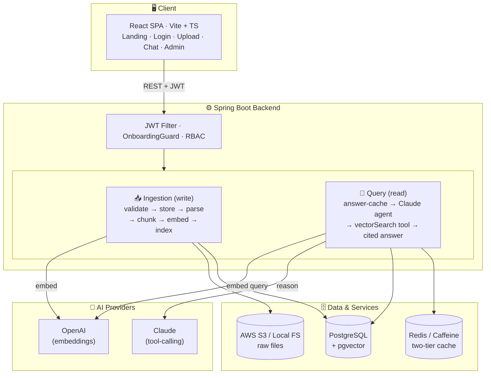
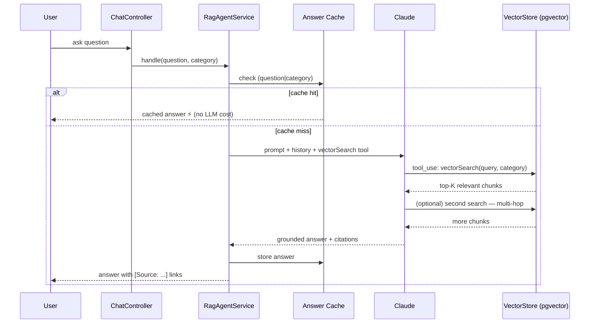

# 📄 Document Intelligence Platform

> An **agentic RAG platform** for enterprise document Q&A. Upload your documents, ask questions in plain
> English, and get accurate answers **with source citations** — powered by Claude, OpenAI embeddings, and pgvector.

<p align="left">
  
  
  
  
  
  
  
</p>

---

## ✨ Overview

Large language models can't answer questions about *your* private documents — they've never seen them.
This platform solves that with **Retrieval-Augmented Generation (RAG)**: it indexes your documents into a
vector database, and when you ask a question, an AI **agent** retrieves the most relevant passages, reasons
across them, and answers **grounded in your actual content** — always citing its sources.

```
"What is Vendor X's penalty for a 3-week late delivery?"
        │
        ▼  the agent retrieves the relevant contract clauses from pgvector
        ▼  Claude reasons over them
        ▼
"Per Section 4.2 of Vendor_X_Contract.pdf, a 2%/week penalty applies → 6%,
 within the 10% cap (Section 4.3).   [Source: Vendor_X_Contract.pdf]"
```

---

## 🏛️ Architecture



**Why RAG (not fine-tuning):** instant knowledge updates, native citations, no costly retraining, and far
lower hallucination — the answer is grounded in passages actually retrieved from your documents.

### How a question is answered



---

## 🚀 Features

**AI & Retrieval**
- 🤖 **Agentic RAG** — Claude uses tool-calling to search documents, do multi-hop reasoning, and cite sources
- 🔍 **Semantic search** — OpenAI embeddings + pgvector cosine similarity (searches *content*, not filenames)
- 💬 **Conversational Q&A** — multi-turn chat with a context window and clickable source citations
- ⚡ **Two-tier caching** — caches both retrieval results *and* full LLM answers (Caffeine → Redis); repeat
  questions return ~100× faster with no LLM cost

**Documents**
- 📥 **Upload from S3 or local storage** behind one provider-agnostic `StorageService` abstraction
- 📄 **Apache Tika parsing** — PDF, DOCX, XLSX, PPTX, TXT
- 🗂️ **Async ingestion** — non-blocking uploads, idempotent (SHA-256 dedup), with a **live progress popup**
  (Parsing → Chunking → Embedding → Indexed)
- 📑 **Pre-signed S3 downloads** — large files download directly from S3, offloading the app server
- 🔎 **Browse by category** + per-user **query history**

**Platform**
- 🔐 **JWT auth** — access + refresh tokens, RBAC, **server-side revocation** ("log out everywhere")
- 🧭 **Onboarding questionnaire** — first-login profile, auto-fillable from an uploaded document via AI
- 👥 **Admin console** — user onboarding/approval, category management, dashboard, audit log
- 🎨 **Polished UI** — landing page, branded login, toasts, skeleton loaders, dark gradient theme
- 🧪 **Tested** — JUnit 5 + Mockito unit suite; OpenAPI/Swagger docs

---

## 🧰 Tech Stack

| Layer | Technology |
|---|---|
| Backend | Java 17, Spring Boot 3.3, Spring AI, Spring Security |
| AI / LLM | Claude (Anthropic), OpenAI `text-embedding-3-small` |
| Vector DB | pgvector (PostgreSQL extension) |
| Caching | Caffeine (local) · Redis (production) |
| Storage | AWS S3, Local FS *(pluggable `StorageService` abstraction)* |
| Parsing | Apache Tika |
| Frontend | React 18, TypeScript, Vite, TailwindCSS, React Query, Zustand |
| Migrations / Docs | Flyway · springdoc-openapi (Swagger UI) |
| Deployment | AWS EC2 / ECS, RDS, S3 |

---

## ⚡ Quick Start (Local)

**Prerequisites:** Java 17 · Maven · PostgreSQL 16 + pgvector · Node.js 20 · Anthropic & OpenAI API keys

```bash
# 1. Database
psql -c 'CREATE DATABASE "DocumentIntelligenceDb";'
psql -d DocumentIntelligenceDb -c 'CREATE EXTENSION IF NOT EXISTS vector;'

# 2. Backend — configure secrets via environment variables (see Configuration below)
cd backend
mvn spring-boot:run -Dspring-boot.run.profiles=dev      # → http://localhost:8081

# 3. Frontend
cd frontend
npm install && npm run dev                              # → http://localhost:5173
```

- Landing page: `http://localhost:5173/`
- Swagger UI: `http://localhost:8081/swagger-ui.html`
- A seeded admin user is created on first run (see your local configuration).

### 🔧 Configuration

All secrets are supplied via **environment variables** (or a gitignored `application-dev.yml`) — **nothing
sensitive is committed**. Copy `.env.example` and fill in your own values:

| Variable | Purpose |
|---|---|
| `ANTHROPIC_API_KEY` | Claude (chat / tool-calling) |
| `OPENAI_API_KEY` | Embeddings |
| `JWT_SECRET` | JWT signing key (≥ 32 chars) |
| `DB_URL` / `DB_USER` / `DB_PASS` | PostgreSQL + pgvector |
| `AWS_S3_BUCKET` / `AWS_REGION` | S3 storage (optional; local FS is the default) |

> On AWS (EC2/ECS), the app uses the instance **IAM role** for S3 — no static keys in production.

---

## 📡 API Highlights

| Method | Endpoint | Description |
|---|---|---|
| `POST` | `/api/auth/login` | Login → access + refresh tokens |
| `POST` | `/api/auth/refresh` | Exchange a refresh token for a new pair |
| `POST` | `/api/documents/upload` | Upload + asynchronously index a document |
| `GET`  | `/api/documents/{id}/download-url` | Pre-signed S3 URL (falls back to streaming) |
| `POST` | `/api/chat/sessions/{id}/messages` | Ask a question → cited answer |
| `GET`  | `/api/admin/stats` | Admin dashboard metrics |

Full interactive reference at **Swagger UI** (`/swagger-ui.html`).

---

## 🔒 Security

- BCrypt password hashing; approval-gated registration (an admin must activate new users)
- Stateless JWT with access/refresh tokens and **token-version revocation** (instant global logout)
- RBAC (ADMIN / USER) enforced at the filter chain and method level
- MIME-validated uploads (Tika content detection, not file extension)
- Prompt-injection defense — user input never enters the system prompt
- Private S3 buckets; downloads via short-lived pre-signed URLs
- Secrets via environment variables / IAM roles — **never committed** (see `.gitignore`)

---

## 🧱 Design Highlights

- **Provider-agnostic storage** — a `StorageService` interface resolved at runtime; pre-signed download is an
  optional capability with graceful fallback to streaming
- **Two-tier, switchable cache** — `@Cacheable` over Caffeine or Redis chosen by a single property; caches
  retrieval results and full answers, with event-based eviction on document changes
- **Stateless + revocable auth** — JWT with a per-user token version for instant global logout
- **Truly async ingestion** — processing runs on a dedicated thread pool (extracted into its own bean so
  Spring's `@Async` proxy applies), returning `202` immediately while a live popup polls the stage
- **Resilient AI calls** — extended timeouts + retry for multi-round-trip tool calling; Anthropic prompt caching

---

## 🗺️ Future Improvements

- [ ] **Azure Blob Storage connector** — ingest from Azure containers (storage abstraction already supports it)
- [ ] **SharePoint connector** — pull from SharePoint libraries via Microsoft Graph (OAuth2)
- [ ] **Large-file uploads** — direct-to-S3 **multipart upload via pre-signed URLs** (GB-scale, bypassing the app server)
- [ ] Hybrid search (vector + BM25 keyword) and HNSW index at scale
- [ ] Streaming chat responses in the UI (SSE backend already built)
- [ ] OCR fallback (AWS Textract) for scanned PDFs
- [ ] Event-driven ingestion worker (SQS/Kafka) for independent scaling

---

## 📂 Repository Structure

```
DocumentIntelligenceSystem/
├── backend/          Spring Boot API (controllers · services · repos · security · config)
├── frontend/         React + TypeScript SPA
├── docker-compose.yml
├── Dockerfile.backend · Dockerfile.frontend · nginx.conf
└── README.md
```

---

## 👤 Author

**Shivam Jain** — Senior Backend Software Engineer

*Built as a deep dive into production-grade RAG architecture, distributed systems, and AI integration.*
